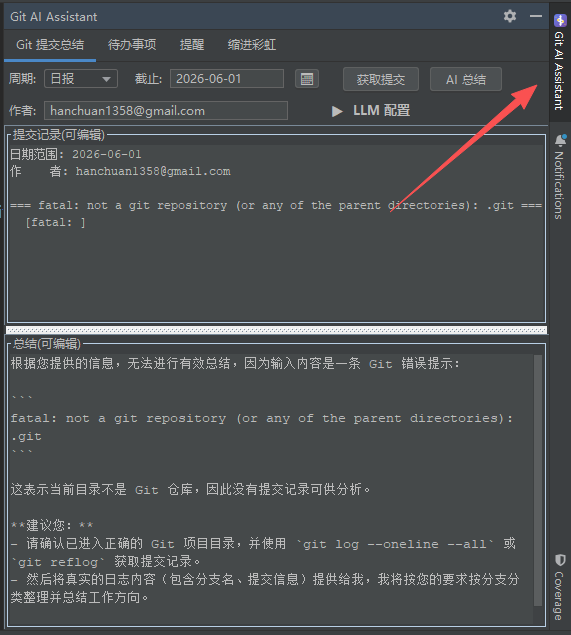

# Git AI Assistant

> 集成 **AI Git 提交总结**、**待办事项管理**、**自定义定时提醒** 和 **缩进彩虹线** 的 IntelliJ IDEA 效率插件。



## 功能

插件以右侧工具窗口的形式提供 4 个标签页：

| 标签页 | 功能 |
|--------|------|
| **Git 提交总结** | 读取 Git 提交记录，调用 LLM 生成日报 / 周报 / 月报，支持流式输出 |
| **待办事项** | 任务管理，支持优先级、截止时间、标签、到期提醒和代码位置关联 |
| **提醒** | 多提醒独立运行，可自定义标题、内容、间隔和弹窗图片 |
| **缩进彩虹** | 按文件类型配置的彩色缩进参考线，附缩进一致性检查表格 |

### 亮点

- **兼容 OpenAI 格式的任意 LLM** — 预置 DeepSeek、通义千问模板，也可自行添加（OpenAI、Ollama、LM Studio 等）
- **API Key 安全存储** — 通过 IntelliJ `PasswordSafe` 保存，不落明文配置
- **实时生效** — 缩进彩虹和各项配置修改后无需重启 IDE
- **开箱即用** — 每个标签页内都内置操作指引

## 环境要求

- IntelliJ IDEA **2024.1** 或更高版本（Community / Ultimate 均可）
- 使用 Git 管理的项目（仅「Git 提交总结」依赖）

## 安装

### 下载安装（推荐）

1. 打开 [Releases](https://github.com/DaiCheng-135/todo/releases) 页面，下载最新的 `git-ai-assistant-*.zip`
2. IntelliJ IDEA → `File` → `Settings` → `Plugins`
3. 点击齿轮图标 → `Install Plugin from Disk...`
4. 选择下载的 `.zip` 文件，重启 IDE

### 从源码构建

```bash
git clone https://github.com/DaiCheng-135/todo.git
cd todo
./gradlew buildPlugin
```

构建产物位于 `build/distributions/git-ai-assistant-1.1.0.zip`，按上面的步骤从磁盘安装即可。

若想在开发模式下直接运行，执行 `./gradlew runIde`。

## 快速开始

安装后，在右侧边栏找到 **Git AI Assistant** 工具窗口（若未显示：`View` → `Tool Windows` → `Git AI Assistant`）。

**生成日报 / 周报 / 月报：**
1. 展开 `▼ LLM 配置`，选择预置模板或点击「+ 添加配置」填入 Endpoint、API Key 和模型名
2. 选择周期（日报 / 周报 / 月报）和截止日期，可选填作者邮箱过滤
3. 点击「获取提交」，确认记录无误
4. 点击「AI 总结」，完成后「复制总结」即可粘贴到日报中

**待办事项：** 点击「新增」填写标题和优先级 → 左键点击切换完成状态 → 右键编辑 / 删除 → 顶部搜索框和筛选按钮快速定位。

**定时提醒：** 点击「＋ 新建提醒」→ 填写标题、内容（`%d` 会被替换为间隔数值）、间隔和单位 → 勾选「启用此提醒」。左侧列表显示实时倒计时，支持单项 / 全部重置。

**缩进彩虹：** 勾选「启用缩进彩虹」→ 调整线条粗细 → 按文件类型勾选需要的语言，实时生效。

> 完整说明、常见问题和使用技巧见 **[使用教程.md](使用教程.md)**。

## 技术栈

- Kotlin 1.9.24
- IntelliJ Platform Plugin SDK 1.17.4（目标 IDE 2024.1，`sinceBuild=241` 无版本上限）
- Gradle Kotlin DSL

源码结构：

```
src/main/kotlin/com/example/todo/
├── action/     编辑器动作（跳转到代码位置等）
├── model/      数据模型（TodoItem、Priority、FilterType 等）
├── service/    业务逻辑（Git 读取、LLM 调用、提醒调度、状态持久化）
├── ui/         工具窗口、面板、对话框与渲染器
└── util/       通知与提醒工具
```

## 反馈

如有 Bug 或功能建议，欢迎在 [Issues](https://github.com/DaiCheng-135/todo/issues) 提交。

