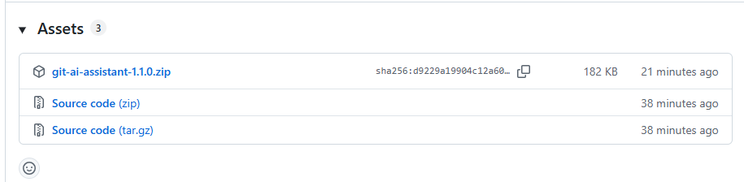
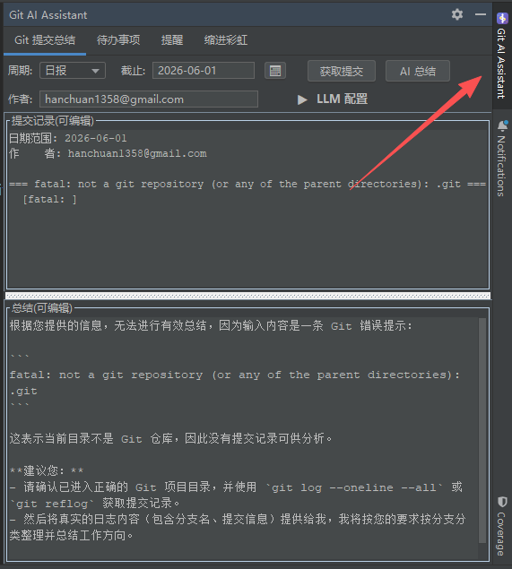
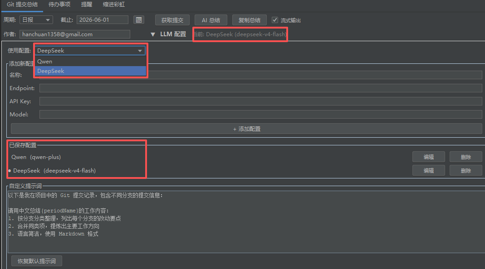

# Git AI Assistant — IntelliJ IDEA 效率插件使用指南

> 一款集成 **AI Git 提交总结**、**待办事项管理**、**自定义定时提醒** 和 **缩进彩虹线** 的 IntelliJ IDEA 插件，让你的开发效率翻倍。

---

## 📖 目录

- [📦 安装](#-安装)
- [🔧 快速开始](#-快速开始)
- [1️⃣ Git 提交总结](#1️⃣-git-提交总结--用-ai-写日报周报月报)
- [2️⃣ 待办事项管理](#2️⃣-待办事项管理--开发任务看板)
- [3️⃣ 自定义定时提醒](#3️⃣-自定义定时提醒--多提醒独立运行)
- [4️⃣ 缩进彩虹线](#4️⃣-缩进彩虹线--代码缩进可视化)
- [🔐 安全说明](#-安全说明)
- [💡 使用技巧](#-使用技巧)
- [❓ 常见问题](#-常见问题)
- [📝 更新日志](#-更新日志)

---

## 📦 安装

### 前提条件

- IntelliJ IDEA **2024.1** 或更高版本（支持 Community / Ultimate）
- 项目需使用 Git 管理（AI 提交总结功能依赖 Git 记录）

### 从源码构建

```bash
git clone https://github.com/DaiCheng-135/todo.git
cd todo
./gradlew buildPlugin
```

构建产物在 `build/distributions/git-ai-assistant-1.1.0.zip`。然后在 IDE 中 `Install Plugin from Disk...` 选择该文件即可。

### 直接下载安装

1. 打开 [GitHub Releases 页面](https://github.com/DaiCheng-135/todo/releases)
2. 下载最新版 `git-ai-assistant-*.zip`

3. 打开 IntelliJ IDEA → `File` → `Settings` → `Plugins`
4. 点击齿轮图标 → `Install Plugin from Disk...`
5. 选择下载的 `.zip` 文件，重启 IDE

---

## 🔧 快速开始

安装后，在右侧边栏找到 **Git AI Assistant** 工具窗口（如果没看到，点击 `View` → `Tool Windows` → `Git AI Assistant`）。



工具窗口包含 4 个标签页：

| 标签页 | 功能 |
|--------|------|
| Git 提交总结 | 自动获取 Git 提交记录，用 AI 生成日报/周报/月报 |
| 待办事项 | 管理开发任务，支持优先级、截止时间、标签 |
| 提醒 | 多提醒独立运行，自定义弹窗图片 |
| 缩进彩虹 | 彩色缩进参考线，按文件类型灵活配置 |

---

## 1️⃣ Git 提交总结 — 用 AI 写日报/周报/月报

告别手动整理 Git 提交，一键生成工作总结。

### 第一步：配置 LLM

展开 **LLM 配置** 区域（点击 `▼ LLM 配置`）：

**选择已有配置：** 插件预置了 Qwen（通义千问）和 DeepSeek 两个模板，从下拉菜单选择即可。

**添加自定义配置：** 点击 **"+ 添加配置"**，填写：

| 字段 | 说明 | 示例 |
|------|------|------|
| 名称 | 任意命名 | 我的配置 |
| Endpoint | API 地址 | `https://api.deepseek.com/chat/completions` |
| API Key | 你的密钥 | `sk-xxx...` |
| Model | 模型名 | `deepseek-chat` / `gpt-4o` / `qwen-plus` |

> 💡 **支持的 API：** 任何兼容 OpenAI Chat 格式的接口都可以，包括：
> - **DeepSeek** — `https://api.deepseek.com/chat/completions`（模型: `deepseek-chat`）
> - **通义千问** — `https://dashscope.aliyuncs.com/compatible-mode/v1/chat/completions`（模型: `qwen-plus`）
> - **OpenAI** — `https://api.openai.com/v1/chat/completions`
> - **本地 LLM**（Ollama / LM Studio 等）


**自定义提示词：** 你可以在下方文本框中修改 AI 总结的提示词模板，使用 `{periodName}` 占位符自动插入周期名称。点击 **"恢复默认提示词"** 可一键还原。

### 第二步：获取提交记录

1. **选择周期** — `日报` / `周报` / `月报`
2. **选择截止日期** — 手动输入 `yyyy-MM-dd` 或点击 📅 用日历选择
3. **填写作者邮箱**（可选）— 只显示你自己的提交，留空则显示全部
4. 点击 **"获取提交"**

提交记录会显示在上方编辑区，你可以手动编辑或删减。

### 第三步：AI 总结

- **勾选「流式输出」** — AI 逐字实时显示，体验更流畅
- **不勾选** — 等待全部生成后一次性显示

点击 **"AI 总结"**，生成的内容显示在下方区域。点击 **"复制总结"** 即可粘贴到日报/周报中。

> 生成的总结按分支分类整理，合并同类项，使用 Markdown 格式，可直接用于周报提交。

---

## 2️⃣ 待办事项管理 — 开发任务看板

### 新建待办

1. 切换到 **「待办事项」** 标签页
2. 点击左上角 **「新增」** 按钮
3. 填写以下信息：

| 字段 | 必填 | 说明 |
|------|------|------|
| 标题 | ✅ | 任务简短描述 |
| 描述 | ❌ | 详细说明 |
| 优先级 | ❌ | 低 / **中** / 高 / 紧急 |
| 截止时间 | ❌ | 选择日期（📅 日历）和时间 |
| 标签 | ❌ | 多个标签用逗号分隔，如 `bug,前端` |
| 到点提醒 | ❌ | 勾选后截止时弹出通知 |

4. 点击 **"确定"** 保存

### 管理待办

待办列表采用两行卡片式布局，一目了然：

- 第一行：**复选框 + 标题**（左）、**截止时间** + **优先级标签**（右）
- 第二行：**标签** 和 **关联代码位置**（灰色小字）

优先级标签颜色：

| 优先级 | 标签 | 颜色 |
|--------|------|------|
| 低 | `低` | 灰色 |
| 中 | `中` | 琥珀色 |
| 高 | `高` | 橙色 |
| 紧急 | `紧急` | 红色 |

截止时间若已过期且未完成，会自动显示为红色提醒。

操作方式：

- **左键点击** — 切换完成/未完成状态（复选框会打勾）
- **按 `Space`** — 切换完成状态
- **按 `Delete`** — 删除选中的待办
- **右键 → 编辑** — 修改待办内容
- **右键 → 删除** — 删除待办

### 搜索与筛选

| 功能 | 操作 |
|------|------|
| 搜索 | 在搜索框输入关键字，按回车搜索（匹配标题、描述、标签） |
| 全部 | 显示所有待办 |
| 未完成 | 只显示未完成的 |
| 已完成 | 只显示已完成的 |
| 高优先级 | 只显示「高」和「紧急」级别的 |
| 已超期 | 只显示过期未完成的 |

> **清空已完成：** 右键点击任意待办 → **「批量指定清空」**，一键删除所有已完成项。

---

## 3️⃣ 自定义定时提醒 — 多提醒独立运行

不只是喝水提醒，你可以创建任意数量的定时弹窗。

### 新建提醒

1. 切换到 **「提醒」** 标签页
2. 点击左侧 **「＋ 新建提醒」**
3. 在右侧填写：

| 字段 | 说明 | 示例 |
|------|------|------|
| 提醒标题 | 弹窗标题 | 该喝水啦 |
| 提醒内容 | 弹窗文字，`%d` 会被替换为间隔数 | `%d 分钟没喝水啦` |
| 提醒间隔 | 数值（1-999） | `30` |
| 间隔单位 | 分钟 / 小时 | 分钟 |
| 启用此提醒 | 勾选后立即生效 | ✅ |
| 提醒图片 | 可选自定义图片（PNG/JPG/GIF/BMP） | 点击「选择」浏览图片 |

> 📸 **关于图片：** 推荐 120×100 像素，支持 PNG/JPG/GIF/BMP。点击弹窗中的图片可查看大图。

### 管理提醒

- **启用/禁用** — 勾选「启用此提醒」即可开关
- **重置选中** — 重新开始当前提醒的倒计时
- **重置全部** — 重置所有提醒
- **删除** — 移除提醒（需要确认）

### 弹窗效果

提醒触发时，会在 IDE 中央弹出一个无边框卡片：

- 显示标题、内容、自定义图片
- 点击「知道了」关闭本次弹窗，计时继续
- 点击「关闭提醒」停止该提醒
- **8 秒后自动淡出**

左侧列表会实时显示每个提醒的 **倒计时 (MM:SS)**，一目了然。

---

## 4️⃣ 缩进彩虹线 — 代码缩进可视化

为编辑器中的每个缩进级别添加彩色竖线，提高代码可读性。

### 启用与配置

1. 切换到 **「缩进彩虹」** 标签页
2. **勾选「启用缩进彩虹」** 开关
3. 选择 **线条粗细**（1-4px，默认 2px）
4. 在文件类型列表中 **点击勾选** 你需要的类型

### 支持的默认文件类型

`Python` · `YAML` · `JSON` · `CSS` · `JavaScript` · `TypeScript` · `Java` · `Kotlin`

### 管理文件类型

- **全部启用 / 全部禁用** — 一键操作
- **添加自定义类型** — 在输入框输入类型名，点击「+ 添加」
- **删除类型** — 勾选要删除的类型，点击「删除已选中」

> 所有修改 **实时生效**，无需重启 IDE。

### 缩进检查

在缩进彩虹面板下方，有一个 **缩进检查** 表格，自动分析当前打开的文件的缩进一致性：

- 显示每一行的缩进层级、对齐状态（✓ / ✗）
- **异常行以浅红色背景高亮**
- **双击表格行** 可跳转到编辑器对应位置
- 缩进不一致的行在编辑器中也会被标记

---

## 🔐 安全说明

- API Key 通过 IntelliJ 的 `PasswordSafe` 安全存储，不会明文写入配置文件
- LLM 配置支持多套，可随时切换
- 所有数据存储在 IDE 本地，不会上传到任何第三方服务（除你配置的 LLM API 外）

---

## 💡 使用技巧

### 组合 Git + 待办 + 提醒，高效开发

**早上一到工位：**
1. 打开 Git 提交总结 → 选「日报」→ 获取昨天的提交 → AI 总结 → 复制到日报文档
2. 在待办列表梳理今天要改什么，标上优先级和截止时间

**开始编码：**
1. 编辑器里缩进彩虹自动生效，代码结构一目了然
2. 遇到 Bug → 新建待办（紧急），顺手在代码位置打个标记

**定时提醒帮你节奏：**
1. 设一个 25 分钟的「番茄钟」提醒 
2. 设一个 60 分钟的「站起来活动」提醒
3. 到点自动弹窗，不会一坐一下午

**下班前：**
1. 右键待办列表 → 「批量指定清空」→ 干掉今天完成的
2. 筛选「未完成」→ 看看哪些拖到了明天

### LLM 配置小贴士

- **国内用户优先用 DeepSeek 或 Qwen**，速度快、无需代理
- Endpoint 地址一定要以 `/chat/completions` 结尾（大部分兼容 OpenAI 的 API 都是这个格式）
- Temperature 固定在 0.3（插件写死的），适合总结类任务，输出稳定不发散
- 可以准备多套配置（如 DeepSeek + Qwen 各一套）在「已保存配置」里一键切换，哪个挂了换另一个

### 提醒内容占位符

提醒内容中的 `%d` 会被插件自动替换为间隔数值。一些有趣的用法：

| 内容 | 效果（间隔 30 分钟） |
|------|------|
| `%d 分钟没喝水啦，快去补充水分吧` | 30 分钟没喝水啦，快去补充水分吧 |
| 🍅 第 %d 分钟番茄钟到啦 | 🍅 第 30 分钟番茄钟到啦 |
| 已经写了 %d 分钟代码，站起来走走 | 已经写了 30 分钟代码，站起来走走 |

### 缩进彩虹调试

如果在某些文件上缩进彩虹不生效，先确认文件类型已勾选。如果还是不行，可能是该文件缩进不统一导致步长检测异常——去「缩进检查」表格看一眼，修复红色标记的行后刷新即可。

---

## ❓ 常见问题

**Q: 获取提交时提示「没有提交记录」？**
A: 检查以下可能：项目是否已初始化 Git（有 `.git` 目录）、Git 是否可在命令行正常使用、作者邮箱是否与 Git 配置匹配（`git config user.email`）、所选日期范围内是否有提交。

**Q: AI 总结失败？**
A: 检查 LLM 配置中的 Endpoint 和 API Key 是否正确（注意密钥不能有空格）、Endpoint 是否以 `/chat/completions` 结尾、网络是否可达（部分国内网络需要代理才能访问 OpenAI）、模型名是否支持。插件会显示具体错误原因。

**Q: AI 总结返回空白？**
A: 部分模型返回格式不标准，可尝试更换模型。DeepSeek 和 Qwen 推荐使用插件预置配置。

**Q: 提醒不弹窗？**
A: 确认三点：① 提醒已勾选「启用此提醒」；② 间隔设置正确（如 1 分钟测试）；③ IDE 的通知未被禁用（右下角铃铛图标 → 管理通知 → Todo Notifications 已启用）。

**Q: 缩进彩虹不生效？**
A: 确认：① 已勾选「启用缩进彩虹」开关；② 当前文件类型在类型列表中已勾选；③ 线条粗细不为 0。尝试在标签页间切换或在编辑器中切换文件触发刷新。

**Q: 待办标签支持中文吗？**
A: 支持。标签以逗号分隔输入，支持中文、英文、数字任意组合。

**Q: TODO 到期了会不会有声音？**
A: 目前以 IntelliJ 通知气泡形式弹出（右上角），无声音。可在 IDE 通知设置中为「Todo Notifications」组开启声音或弹窗提醒。

**Q: 插件配置会丢失吗？**
A: v1.1.0 修复了持久化问题，重启 IDE 后配置不会丢失。如有异常，检查 IDE 日志（`Help` → `Show Log in Explorer`）。

---

## 📝 更新日志

**v1.1.0**
- 全新多提醒系统：支持创建多个独立定时提醒
- LLM 流式输出：AI 总结支持逐字实时输出
- 提醒弹窗支持自定义图片（PNG/JPG/GIF/BMP）
- 提醒列表实时倒计时、单项重置、重置全部
- 修复状态持久化问题，重启不再丢失配置

**v1.0.0**
- AI Git 提交总结（日报/周报/月报）
- 待办事项管理（优先级、截止日期、标签）
- 缩进彩虹线可视化
- 喝水提醒

---

> **项目地址：** [github.com/DaiCheng-135/todo](https://github.com/DaiCheng-135/todo)
> **反馈与建议：** 如有 Bug 或需求，欢迎在 [GitHub Issues](https://github.com/DaiCheng-135/todo/issues) 提交！